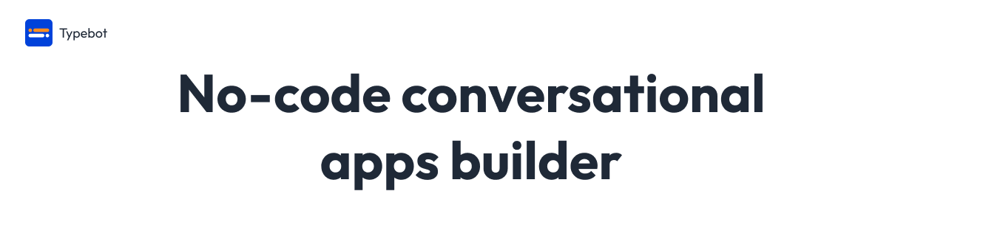
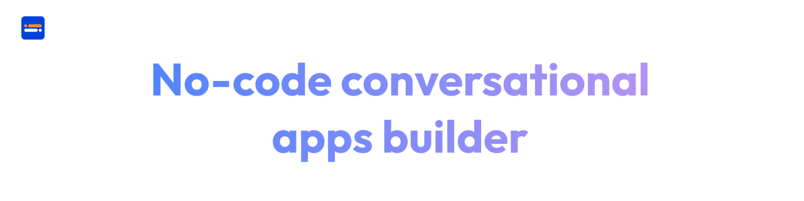
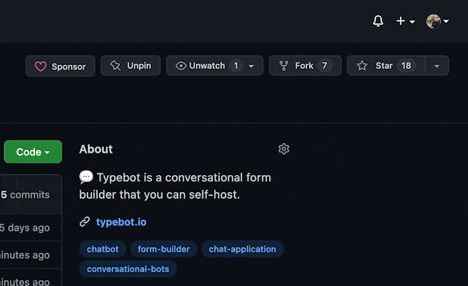

  
  

https://user-images.githubusercontent.com/16015833/168876388-0310678d-080b-4eca-8633-e5cc4d7bd5d1.mp4

AutoRepl is an open-source alternative to Landbot. It allows you to create conversational apps/forms (Lead qualification, Product launch, User onboarding, Customer support), embed them anywhere on your web/mobile apps, and collect results in real-time.

## Features

- Text, image, video bubble messages
- Text, URL, email, phone number, date... input fields
- Native integrations including Google Sheets, Webhooks, Send email (more to come)
- Conditional branching, URL redirections
- Beautiful animations
- Theme is 100% customizable
- Embed as a container, popup, or chat bubble easily with the native JS library
- In-depth analytics

For more info, visit the [landing page](https://www.autorepl.com)

## Stay up-to-date

Lots of new features are being implemented on a day-to-day basis. Make sure to hit the **Star** button and watch **Releases** to be notified of future features.

## Getting started with AutoRepl

The easiest way to get started with AutoRepl is with [the official managed service in the Cloud](https://app.autorepl.com).

It takes 1 minute to try out the builder for free. You'll have high availability, backups, security, and maintenance all managed for you.

That's also the best way to support my work, open-source software, and you'll get great service!

## Contribute

Another great way to support AutoRepl is to contribute to the project. Head over to the [Contribute guidelines](https://github.com/mustafaersoyer/autorepl.com/blob/main/CONTRIBUTING.md) to get started. 😍

## Technology

AutoRepl is a Monorepo powered by [Turborepo](https://turborepo.org/). It is composed of 2 main applications:

- the builder, where you build your bots
- the viewer, where your user answer the bot

These apps are built with awesome web technologies including [Typescript](https://www.typescriptlang.org/), [Next.js](https://nextjs.org/), [Prisma](https://www.prisma.io/), [Chakra UI](https://chakra-ui.com/), [Tailwind CSS](https://tailwindcss.com/).

## License

AutoRepl is open-source under the GNU Affero General Public License Version 3 (AGPLv3). You can find it [here](./LICENSE).

In a few words, it means that:

- If you commercialize your version of Typebot. You need to be clear and provide a prominent mention and link to the original project so people that are considering using their version of the software can be aware of the original project
- If you modify the original software, you need to open source and publish your modifications

AutoRepl is a clone of TypeBot. 
